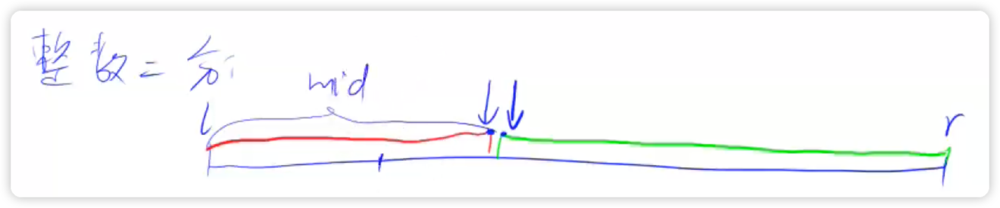

- 版本1
- 当我们将区间[l, r]划分成[l, mid]和[mid + 1, r]时，其更新操作是r = mid或者l = mid + 1;，计算mid时不需要加1。


> 整数二分是求红色范围的右端点 或者 绿色范围的左端点 减1加1



```python3
arr, n, x = [], 100, 1
# 搜索出左端点的下标  (绿色区域的左边界值)
# 区间[l, r]被划分成 [l, mid] 和 [mid+1, r]时使用
# mid归于左边, r = mid, mid选择 不 +1
l, r = 0, n - 1
while l < r:
    mid = (l + r) // 2
    # check(mid)
    if arr[mid] >= x:
        r = mid
    else:
        l = mid + 1

```

- 版本2
- 当我们将区间[l, r]划分成[l, mid - 1]和[mid, r]时，其更新操作是r = mid - 1或者l = mid;，此时为了防止死循环，计算mid时需要加1。

```python3
arr, n, x = [], 100, 1

# 搜索出右端点的下标 (红色区域的右边界值)
# 区间[l, r]被划分成 [l, mid-1] 和 [mid, r]时使用
# mid归于右边, l = mid, mid选择 +1
l, r = 0, n - 1
while l < r:
    mid = (l + r + 1) >> 1
    # check(mid)
    if arr[mid] <= x:
        l = mid
    else:
        r = mid - 1
```

```bash
先写一个check函数
判定在check的情况下（true和false的情况下），如何更新区间。
在check(m)==true的分支下是:
l=mid的情况，中间点的更新方式是m=(l+r+1)/2
r=mid的情况，中间点的更新方式是m=(l+r)/2
这种方法保证了：
1. 最后的l==r
2. 搜索到达的答案是闭区间的，即a[l]是满足check()条件的。
```

- bis_left函数返回排序数组中值等于k的最左索引，如果没有，就返回插入后其索引
- bis_right函数返回排序数组中值等于k的最右索引 + 1，如果没有，就返回插入后其索引
- bis函数返回排序数组中值等于k的最右索引 + 1，如果没有，就返回插入后其索引

