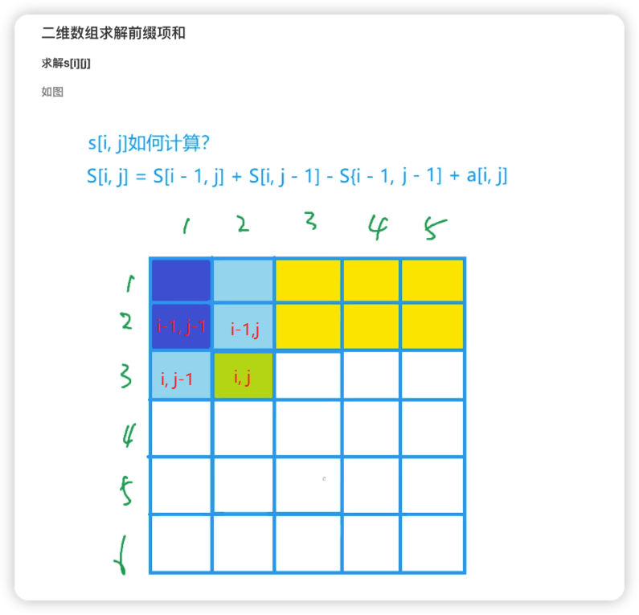
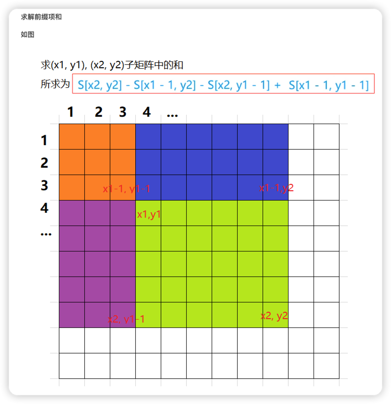

- 什么是前缀和
    - 原数组: a[1], a[2], a[3], a[4], a[5], …, a[n]
    - 前缀和 Si为数组的前 i项和
    - 前缀和: S[i] = a[1] + a[2] + a[3] + … + a[i]

> 一维数组前缀和

- 一维数组求解前缀和(Si)
  for循环求出 每个S[i] (将 S[0] 定义为 0, 避免下标的转换)
  求 [l, r]中的和, 即为 S[r] - S[l-1]

```python3
  n, m = 10, 10
  arr = []
  
  sum = [0] * n
  sum[0] = arr[0]
  for i in range(1, n):
      sum[i] = sum[i - 1] + arr[i]

```

> 二维数组前缀和 主要是用来求一个最大的矩形区间和



