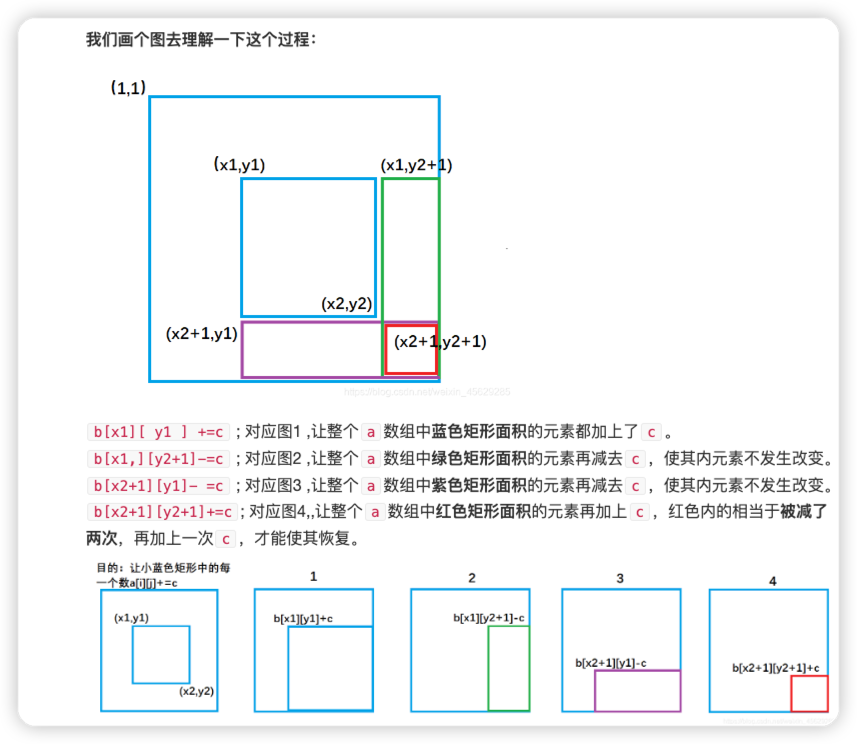

### 一维差分，多用于在某一个区间里做加法，能将O(n)的时间复杂度转换为O(1)；
- 其主要是思想是： a[]是b[]的前缀和，即 a[i] = a[i-1] + b[i];

- a[]数组是b[]数组的前缀和数组, 那么b[]是a[]的差分，即b[i] = a[i] - a[i-1];

如
b[1] = a[1
b[2] = a[2] - a[1]
b[3] = a[3] - a[2]

题目要求在a[l]和a[r]中间所有数都加上一个c，因为a[i] = b[i] + b[i-1] + … + b[2] + b[1]; 所以a[i]后面的数都会加上b[i]，b[i]加c了，a[i]
后的数也会相应全部加c，如insert函数。

```python3
# a[i] 后面的元素全部加上c  
def insert(l, r, c):
    # 因为a[i] = b[i] + b[i-1] + ... + b[2] + b[1];所以a[i]后面的数都会加上b[i]，b[i]加c了，a[i]后的数也会相应全部加c
    b[l] += c
    # 同理a[r+1] 后面的元素都减去一个c
    b[r + 1] -= c
```

**为什么b[r+1] -= c?
这是因为我们只需要l到r之间的数加上c，但是经过b[l] += c后，a[r]后的数也加上了c，因此需要使用b[r+1]-=c; 再减去一个c。**


### 二维差分 能将O(n*n)的时间复杂度优化成O(1)



- a[][]数组是b[][]数组的前缀和数组，那么b[][]是a[][]的差分数组
- 原数组： a[i][j]
- 我们去构造差分数组： b[i][j]
- 使得a数组中a[i][j]是b数组左上角(1,1)到右下角(i,j)所包围矩形元素的和。

> 始终要记得，a数组是b数组的前缀和数组，比如对b数组的b[i][j]的修改，会影响到a数组中从a[i][j]及往后的每一个数。

> 构造差分数组
```python3
    for i in range(1, n + 1):
        insert(i, i, a[i])
```

```python3
# 对b数组执行插入操作，等价于对a数组中的(x1,y1)到(x2,y2)之间的元素都加上了c
def insert(x1, y1, x2, y2, c):
    b[x1][y1] += c
    b[x2 + 1][y1] -= c
    b[x1][y2 + 1] -= c
    b[x2 + 1][y2 + 1] += c
```