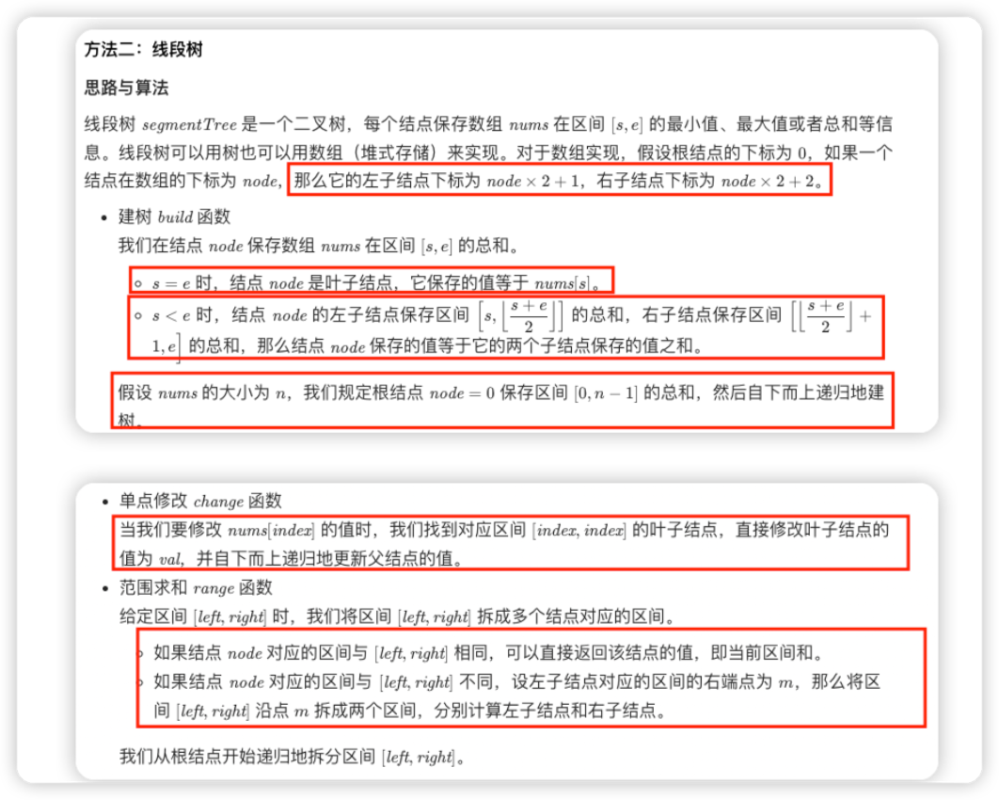

## 线段树

线段树segmentTree 是一个二叉树，每个结点保存数组nums 在区间 [s, e]的最小值、最大值或者总和等信息。


> 线段树的所有操作同样为 O(log{n})，O(logn)，由于本题不涉及「区间修改」操作，因此我们的线段树只需要实现 pushup 操作（子节点往上更新父节点），而不需要实现用于懒标记的 pushdown 操作（父节点往下传递「更新」的操作）。

关于线段树设计的几种操作：




```java
void build(int u, int l, int r)：含义为从编号为 u 的节点开始，构造范围为 [l,r] 的树节点；
void update(int u, int x, int v)：含义为从编号为 u 的节点开始，在 x 位置增加 v；
更具一般性（涉及区间修改）的操作应该为 void update(int u, int l, int r, int v)，代表在 [l, r] 范围增加 v；
int query(int u, int l, int r)：含义为从编号为 u 的节点开始，查询 [l, r] 区间和为多少。
```

### [307. 区域和检索 - 数组可修改](https://leetcode.cn/problems/range-sum-query-mutable/) --线段树